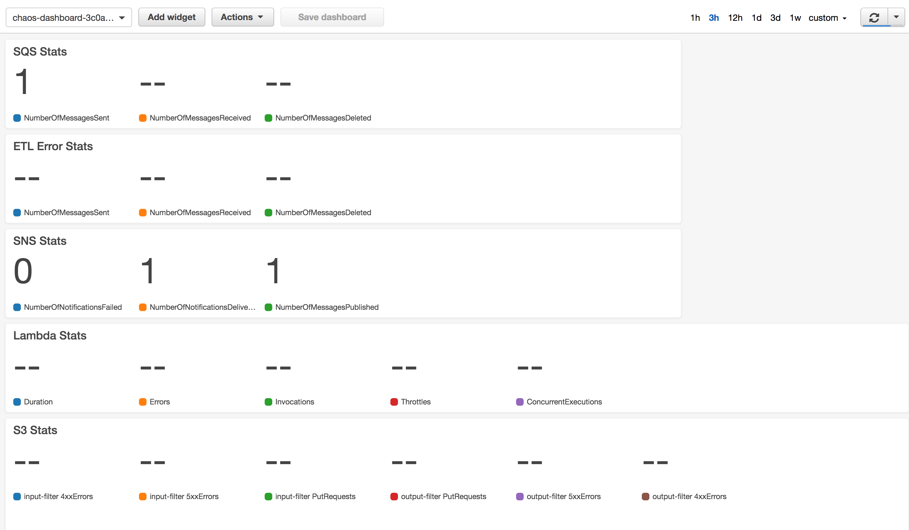

# Lab 1: Build a serverless ETL pipeline

## Overview

In this lab you will use infrastructure-as-code tooling to deploy a serverless ETL pipeline into AWS.  This pipeline is designed to accept JSON documents and convert them to CSV.  The infrastructure-as-code will create a metrics dashboard which you can use to monitor the pipeline's performance.  To test the pipeline and its dashboard you will execute drivers to push traffic through the pipeline.

## Objectives
 - Observe the architecture and assess the applications steady state
 - Review the custom code in the AWS Lambda function
 - Determine the service level objectives you will use to measure your steady state

 ---

 ## Create the pipeline

 **Step-by-step**
 1. Using the Terraform cli, deploy the architecture

    ```bash
    $ cd terraform
    $ terraform init
    $ terraform apply .
    ```

 1. Visit the dashboard for the ETL pipeline using the [AWS CloudWatch Console](https://console.aws.amazon.com/cloudwatch/home?#dashboards:).  Look for and open the dashboard with a name such as `chaos-dashboard-3c0ad6c72e1a1234`.

     

 1. Review the ETL Lambda function via the [AWS Lambda console](https://console.aws.amazon.com/lambda/home?#/functions).

 1. To begin sending files through the pipeline execute the two driver programs provided for you in the `drivers` directory:

     ```bash
     $ cd ../drivers
     $ ./the_publisher &
     $ ./the_subscriber &
     ``` 

