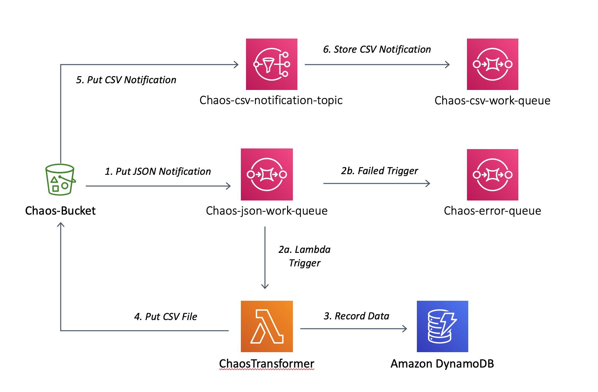
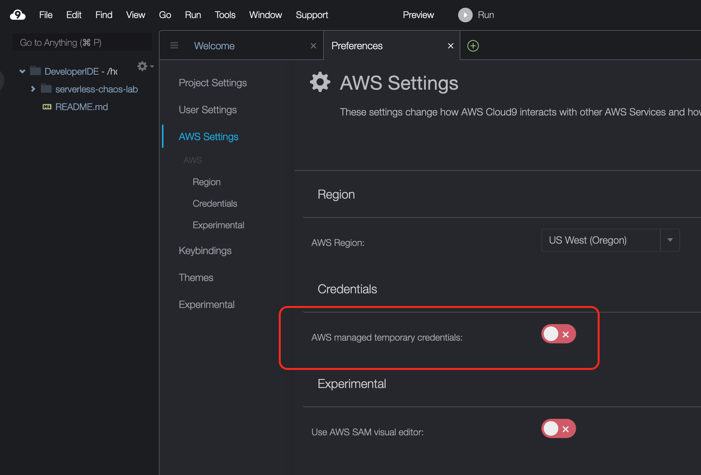

# Lab 1: Build a serverless ETL pipeline

## Overview

In this lab you will use infrastructure-as-code tooling to deploy a serverless ETL pipeline into AWS.  This pipeline is designed to accept JSON documents, convert them to CSV, and update a DynamoDB table with stats pulled from the data.  The infrastructure-as-code will create a an architecture similar to that shown below.



    ETL Workflow:
    The process is started when a JSON document is put into the Chaos-Bucket.

      1. S3 sends a notification of the new object to SQS
      2a. SQS triggers Lambda to process the vent
      2b. IFF the Lambda fails to process the event the event is stored in a dead letter queue with the SQS service
      3. The Lambda function updates DynamoDB with summary data of the record and a copy of the record itself
      4. The Lambda function writes the tranformed file as a CSV back to the Chaos-Bucket
      5. S3 sends a notification of the transformed object to SNS
      6. SNS sends a copy of the event to SQS for retrieval by a downstream client or subscriber

After deploying the architecture you will use drivers to publish and consume JSON and CSV files through the architecture.  These drivers will run throughout the labs.

## Objectives
 - Observe the architecture and assess the applications steady state
 - Review the custom code in the AWS Lambda function
 - Determine the service level objectives you will use to measure your steady state

 ---

## Create the pipeline

> Note: If you are using an AWS Cloud9 IDE you may need to disable [AWS managed credentials](https://docs.aws.amazon.com/cloud9/latest/user-guide/how-cloud9-with-iam.html#auth-and-access-control-temporary-managed-credentials).  To disable AWS managed credentials open the **Preferences** pane for your IDE and disable `AWS managed credentials`.
   

1. Using the Terraform cli, deploy the architecture

    ```bash
    $ cd terraform
    $ terraform init
    $ terraform apply -auto-approve
    ```

    > If you are asked to specify a region use an AWS region code such as `us-east-2`, `eu-west-2`, or `ap-southeast-1`.

## Review the architecture

1. Review the ETL Lambda function via the [AWS Lambda console](https://console.aws.amazon.com/lambda/home?#/functions).  

    The function will be named something like `ChaosTransformer-1234ABCD`.  Make a note of the function's configuration, what causes it to execute, how long can it execute for, what environment variables does it have configured, etc.

    If you would like to review the code for your Lambda function you can see it in the `lambda.js` file in the `src` directory of this repository.

1. Review the DynamoDB table created using the [AWS DynamoDB console](https://console.aws.amazon.com/dynamodb/home?#tables:).

    The table will be named something like `chaos-data-1234ABCD`.  It is unlikely to have any data in it yet as we have yet put any files into the ETL pipeline.

1. Review the [SQS queues](https://console.aws.amazon.com/sqs/home?#) and [SNS topics](https://console.aws.amazon.com/sns/v3/home?#/topics) that were created.  Note any triggers associated with the queues and topics.

    You will note that there are multiple SQS queues for holding new data file notifications (`chaos-json-work-queue-1234ABCD`), holding converted file notifications (`chaos-csv-work-queue-1234ABCD`), and a dead letter queue for any failed processing (`chaos-error-queue-1234ABCD`).

    There should be a single SNS topic named something like `chaos-csv-notification-topic-1234ABCD`.

1. Also visit the [S3 console](https://s3.console.aws.amazon.com/s3/home?) and find the bucket named something like `chaos-bucket-1234ABCD`.

## Apply a load

1. To begin sending files through the pipeline execute the two driver programs provided for you in the `drivers` directory:

     ```bash
     $ cd ../drivers
     $ ./the_publisher.py &
     $ ./the_subscriber.py &
     ```

    > **Note:** If you get a "botocore.exceptions.NoRegionError: You must specify a region." error message when executing the driver programs, you will need to configure your AWS CLI with `aws configure`, specifying the same region code as used above with Terraform.

1. Revisit some of the previous consoles for AWS Lambda, SQS, SNS, DynamoDB, and Amazon S3.  

    You'll start to see the S3 bucket populated with files, items being stored into DynamoDB, and metrics generated by the Lambda function for every execution.  Take a moment and review some of the information these consoles make available to you.

## Steady State

Files are now being sent to Amazon S3, the entry point of your ETL pipeline.  Upon landing in the S3 bucket the ETL Lambda function is being triggered to parse the received file, convert it to CSV, and write the CSV file back into the S3 bucket.  When the CSV file lands in S3 the Amazon S3 service sends a notification to an SNS topic which has an SQS queue subscribed to the topic.  

When a file is encountered by the ETL Lambda function which it cannot parse it will experience an exception.  S3 will invoke the Lambda function 2 more times in an effort to parse the file, if all 3 invocations experience an error the message will be stored into the dead letter queue configured for the Lambda function.

An [Amazon CloudWatch Dashboard](https://console.aws.amazon.com/cloudwatch/home?#dashboards:) has been created for this pipeline which tracks various metrics for the architecture.  Please use this to gain insight into the current state of the pipeline.

## Summary

In this lab you used Infrastructure-as-Code to deploy a serverless ETL pipeline.  You reviewed the various AWS consoles associated with the AWS services in use, and you also applied a load to the architecture using drivers to push files to and pull notifications from the ETL architecture.

Leave the drivers running, in [the next lab](lab_2_inject_fault.md) you will begin to use chaos engineering tooling to learn how to inject failures into the serverless architecture.
